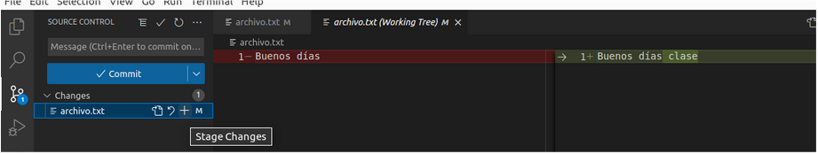

<!DOCTYPE html>
<html lang="es-es">
<head>
    <meta charset="UTF-8">
</head>  
<body>
    <h1>Actividad 3: Git + IDE</h1>
    <h2>Creación de un repositorio en local</h2>
    
Seleccionamos la tercera pestaña dentro de Visual studio code que tiene el icono

    

        ![imagen][1]
    

    
Y seleccionar Open Folder(Abrir la carpeta)

    

        
    

    
Una vez elegida la carpeta podremos inicializarla, solo tendremos que darle a 

    

        
    

    <h2>Modificación de archivos</h2>
    
Una vez inicializado el repositorio podremos modificar los archivos que contenga este, en mi caso tengo un archivo.txt que voy a modificar como ejemplo:
    

    

        
    

    <h2>Commit</h2>
    
A la hora de modificar un archivo en la pestaña anterior nos aparecerá un (1) indicando que hay cambios nuevos y tendremos que realizar un commit.

    

        
    

    
Tendremos que darle al símbolo + que hay al lado de la M

    

        
    

    
En la opción Stage Changes

    

        
    

    
En la barra de arriba escribimos el comentario y le damos a commit.

    

        
    

    
Sync Changes para guardar los cambios.

    

        
    

    
Ya dentro de GitHub nos aparece el archivo sincronizado con el mensaje que pusimos durante el commit

    

        
    

</body>    
</html>

